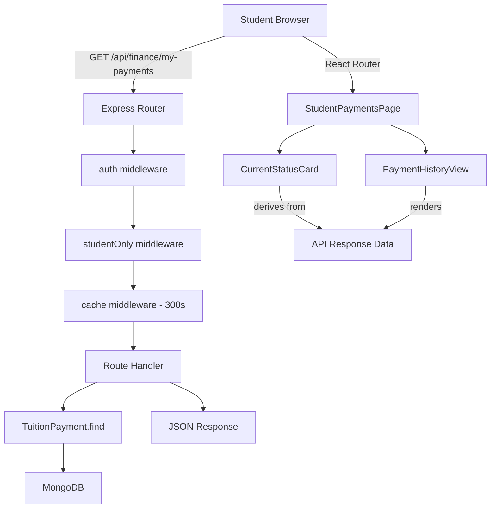

# Design Document: Student Finance View

## Overview

This feature adds a "My Payments" section to the student dashboard, allowing students to view their current month payment status and full payment history. The implementation spans:

- **Backend**: A new API endpoint (`GET /api/finance/my-payments`) restricted to authenticated students, querying the existing `TuitionPayment` model.
- **Frontend**: A new page (`StudentPaymentsPage`) with two main components — `CurrentStatusCard` (current month status) and `PaymentHistoryView` (historical records table). Navigation is added to the Sidebar for students only.

### Design Decisions

1. **Dedicated endpoint vs. reusing existing finance routes**: The existing `/api/finance` routes are admin-only with complex filtering. A separate student-specific endpoint is cleaner, avoids permission conflicts, and returns only the authenticated student's data.
2. **Single API call**: One endpoint returns all payment records for the student. The frontend derives the current month status from this data, avoiding a second API call.
3. **Per-user caching**: Leverages the existing `cache` middleware with user-scoped keys (already implemented in `cache.middleware.js`) for performance.
4. **New page vs. inline section**: A dedicated route (`/my-payments`) keeps the student dashboard uncluttered and allows direct navigation.

## Architecture



### Request Flow

1. Student navigates to `/my-payments` in the frontend
2. `StudentPaymentsPage` component mounts and calls `GET /api/finance/my-payments`
3. Backend authenticates via JWT (`auth` middleware), checks role is `student` (`studentOnly` middleware)
4. Checks Redis cache for user-scoped key; on miss, queries MongoDB
5. Returns sorted payment records as JSON array
6. Frontend derives current month status from the response and renders both components

## Components and Interfaces

### Backend

#### New Middleware: `studentOnly`

Added to `Backend/middleware/auth.middleware.js`:

```javascript
authMiddleware.studentOnly = (req, res, next) => {
    if (!req.user || req.user.role !== 'student') {
        return res.status(403).json({ message: 'Access denied. Student role required.' });
    }
    next();
};
```

#### New Route: `GET /api/finance/my-payments`

File: `Backend/routes/finance.js` (added to existing finance router)

```javascript
router.get('/my-payments', [auth, auth.studentOnly, cache(300)], asyncHandler(async (req, res) => {
    const studentId = req.user.userId;
    
    const payments = await TuitionPayment.find({ student: studentId })
        .populate('group', 'name')
        .sort({ billingPeriod: -1 })
        .lean();

    const result = payments.map(p => ({
        billingPeriod: p.billingPeriod,
        amountDue: p.amountDue,
        amountPaid: p.amountPaid,
        paymentDate: p.paymentDate || null,
        status: p.status,
        groupName: p.group?.name || 'Unknown'
    }));

    res.json(result);
}));
```

**Response Shape:**
```json
[
  {
    "billingPeriod": "2025-06",
    "amountDue": 150,
    "amountPaid": 150,
    "paymentDate": "2025-06-10T12:00:00.000Z",
    "status": "paid",
    "groupName": "Web Development A"
  }
]
```

### Frontend

#### New Page: `StudentPaymentsPage`

File: `src/pages/StudentPaymentsPage.jsx`

Responsibilities:
- Fetches data from `/api/finance/my-payments` on mount
- Manages loading/error/data state
- Passes current month payment to `CurrentStatusCard`
- Passes full history to `PaymentHistoryView`
- Provides retry mechanism on failure

```javascript
// State management
const [payments, setPayments] = useState([]);
const [loading, setLoading] = useState(true);
const [error, setError] = useState(null);

// Derive current month status
const currentPeriod = `${now.getFullYear()}-${String(now.getMonth() + 1).padStart(2, '0')}`;
const currentPayment = payments.find(p => p.billingPeriod === currentPeriod) || null;
```

#### Component: `CurrentStatusCard`

File: `src/components/StudentPayments/CurrentStatusCard.jsx`

Props:
- `payment: Object | null` — current month payment record or null
- `loading: boolean` — whether data is being fetched
- `error: string | null` — error message if fetch failed
- `onRetry: () => void` — retry callback

Renders:
- Loading state: spinner/skeleton
- Error state: error message + retry button
- `paid`: FiCheckCircle icon, green styling, paid amount, payment date
- `unpaid`: FiClock icon, yellow styling, amount due
- `overdue`: FiAlertCircle icon, red styling, overdue amount
- `null` (no invoice): FiFileText icon, neutral styling, informational message

#### Component: `PaymentHistoryView`

File: `src/components/StudentPayments/PaymentHistoryView.jsx`

Props:
- `payments: Array` — all payment records
- `loading: boolean` — whether data is being fetched
- `error: string | null` — error message if fetch failed
- `onRetry: () => void` — retry callback

Renders:
- Loading state: spinner/skeleton
- Error state: error message + retry button (preserves previous data if available)
- Empty state: informational message when no records exist
- Records list: each record shows formatted billing period, amount due, amount paid, color-coded status badge

#### Sidebar Update

File: `src/components/Sidebar/Sidebar.jsx`

Add conditional navigation item for students:

```jsx
{role === 'student' && (
    <li>
        <NavLink to="/my-payments" className={styles.menuItem} activeClassName={styles.active} title="My Payments">
            <FiDollarSign size={24} />
        </NavLink>
    </li>
)}
```

#### Route Registration

File: `src/App.jsx`

Add a student-only route:

```jsx
const StudentPaymentsPage = lazy(() => import('./pages/StudentPaymentsPage.jsx'));

// Inside Switch, after student dashboard route:
{role === 'student' && <Route path="/my-payments"><StudentPaymentsPage /></Route>}
// Non-students accessing /my-payments get redirected
```

### CSS Modules

New files:
- `src/pages/StudentPaymentsPage.module.css`
- `src/components/StudentPayments/CurrentStatusCard.module.css`
- `src/components/StudentPayments/PaymentHistoryView.module.css`

Status color scheme:
- `.statusPaid` — green background/text (`#e6f9f0` / `#1a7f4b`)
- `.statusPending` — yellow/amber background/text (`#fff8e6` / `#b8860b`)
- `.statusOverdue` — red background/text (`#fde8e8` / `#c0392b`)
- `.statusDefault` — gray background/text (`#f0f2f5` / `#6c757d`)

## Data Models

### Existing: TuitionPayment (no changes)

```javascript
{
    student: ObjectId (ref: 'User'),      // required
    group: ObjectId (ref: 'Group'),       // required
    billingPeriod: String,                // 'YYYY-MM', indexed
    amountDue: Number,                    // required
    amountPaid: Number,                   // default: 0
    paymentDate: Date,                    // optional
    status: String,                       // enum: ['unpaid', 'paid', 'overdue']
    createdAt: Date,                      // auto (timestamps)
    updatedAt: Date                       // auto (timestamps)
}
// Compound unique index: { student: 1, billingPeriod: 1 }
```

### API Response DTO

```typescript
interface PaymentRecord {
    billingPeriod: string;    // "YYYY-MM"
    amountDue: number;
    amountPaid: number;
    paymentDate: string | null;  // ISO date string or null
    status: 'unpaid' | 'paid' | 'overdue';
    groupName: string;
}
```

### Frontend State

```typescript
interface PaymentsPageState {
    payments: PaymentRecord[];
    loading: boolean;
    error: string | null;
}
```

## Correctness Properties

*A property is a characteristic or behavior that should hold true across all valid executions of a system — essentially, a formal statement about what the system should do. Properties serve as the bridge between human-readable specifications and machine-verifiable correctness guarantees.*

### Property 1: API returns all student records sorted descending by billingPeriod

*For any* authenticated student with any set of TuitionPayment records in the database, the Student_Finance_API SHALL return exactly all records belonging to that student, and the returned array SHALL be sorted such that for every consecutive pair of elements, the billingPeriod of the earlier element is lexicographically greater than or equal to the billingPeriod of the later element.

**Validates: Requirements 1.1**

### Property 2: API response contains all required fields with correct types

*For any* TuitionPayment record belonging to an authenticated student, the corresponding object in the API response SHALL contain: billingPeriod (string matching "YYYY-MM"), amountDue (number), amountPaid (number), paymentDate (ISO date string or null), status (one of "unpaid", "paid", "overdue"), and groupName (string).

**Validates: Requirements 1.2**

### Property 3: Payment history renders all required information for each record

*For any* payment record with arbitrary valid billingPeriod, amountDue, amountPaid, and status values, the PaymentHistoryView rendered output for that record SHALL contain: a locale-formatted month/year string derived from the billingPeriod, the amount due value, the amount paid value, and a status indicator corresponding to the record's status.

**Validates: Requirements 3.2**

## Error Handling

### Backend Errors

| Scenario | HTTP Status | Response Body | Notes |
|----------|-------------|---------------|-------|
| No auth token / invalid token | 401 | `{ message: "Нет авторизации" }` | Handled by existing `auth` middleware |
| Non-student role | 403 | `{ message: "Access denied. Student role required." }` | New `studentOnly` middleware |
| Database error | 500 | `{ message: "Internal server error" }` | Handled by existing `errorHandler` middleware |
| Redis unavailable | N/A (transparent) | Normal response without caching | Cache middleware skips gracefully |

### Frontend Error Handling

| Scenario | Behavior |
|----------|----------|
| API returns 401 | Global axios interceptor redirects to `/login` |
| API returns 403 | Should not happen (route is student-only); display generic error |
| API returns 500 | Display error message in component, show retry button |
| Network timeout (10s) | Display error message, show retry button |
| API succeeds after retry | Replace error state with data |
| API fails after retry | Keep showing error with retry option |

### Retry Strategy

- Single retry button (manual, user-initiated)
- No automatic retry or exponential backoff (keeps UX simple)
- On retry: reset error state, show loading, re-fetch
- Preserve previously loaded data on subsequent failures (if data was loaded before)

## Testing Strategy

### Backend Tests

**Framework**: Jest + Supertest + mongodb-memory-server (existing setup)

**Unit/Integration Tests** (example-based):
- Authentication: 401 for unauthenticated requests
- Authorization: 403 for admin and teacher roles
- Empty state: 200 with empty array for student with no records
- Error handling: 500 on database failure (mocked)
- Response shape: verify all fields present for a known record
- Sorting: verify descending order with known data set
- Group population: verify groupName is populated from Group document

**Property-Based Tests** (using `fast-check`):
- Property 1: Generate random sets of payment records, verify API returns them all sorted descending
- Property 2: Generate random payment records with varying field values, verify response shape
- Minimum 100 iterations per property test
- Tag format: `Feature: student-finance-view, Property {N}: {description}`

**Property Test Library**: `fast-check` (JavaScript property-based testing library, well-maintained, works with Jest)

### Frontend Tests

**Framework**: Would require adding Vitest + React Testing Library (not currently in project). For now, manual testing is primary.

**Example-based tests** (if test framework added):
- CurrentStatusCard renders correct icon/styling for each status
- CurrentStatusCard shows loading state
- CurrentStatusCard shows error with retry button
- PaymentHistoryView renders all records with correct formatting
- PaymentHistoryView shows empty state
- PaymentHistoryView shows loading state
- PaymentHistoryView preserves data on error after initial load
- Sidebar shows "My Payments" for student role only
- Route redirects non-students away from `/my-payments`

**Property-Based Test** (if test framework added):
- Property 3: Generate random payment records, render PaymentHistoryView, verify all required info present
- Minimum 100 iterations
- Tag: `Feature: student-finance-view, Property 3: Payment history renders all required information`

### Test Configuration

```javascript
// Backend property test example structure
describe('Feature: student-finance-view', () => {
    it('Property 1: API returns all student records sorted descending by billingPeriod', async () => {
        await fc.assert(fc.asyncProperty(
            arbitraryPaymentRecords(),
            async (records) => {
                // Insert records, call API, verify sort and completeness
            }
        ), { numRuns: 100 });
    });
});
```
